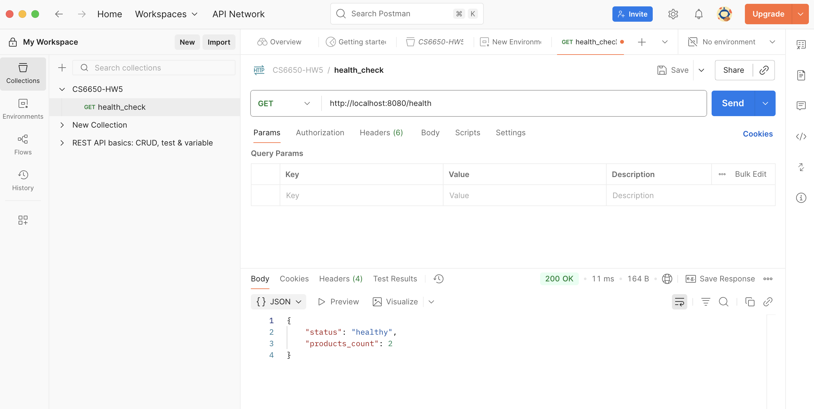
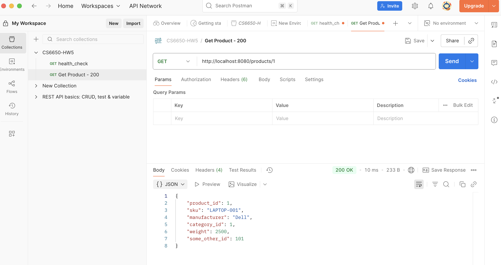
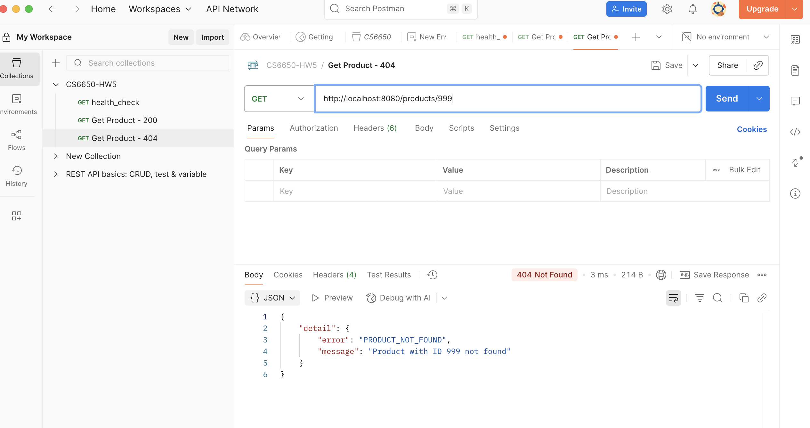
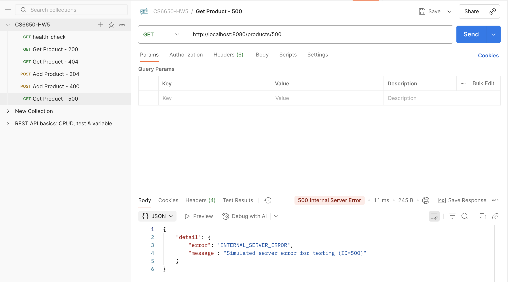
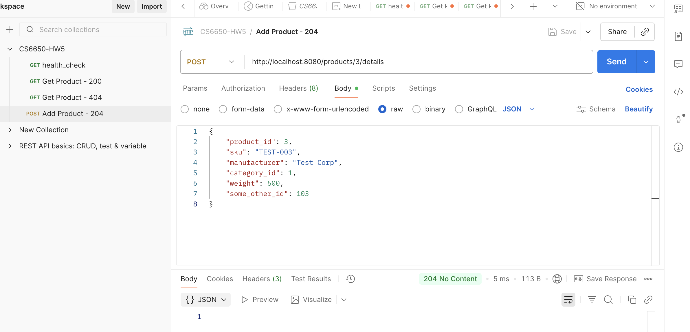
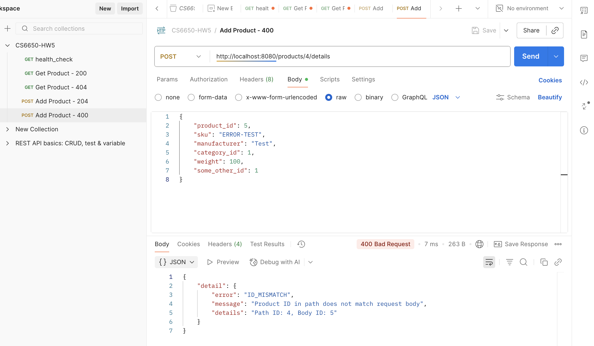
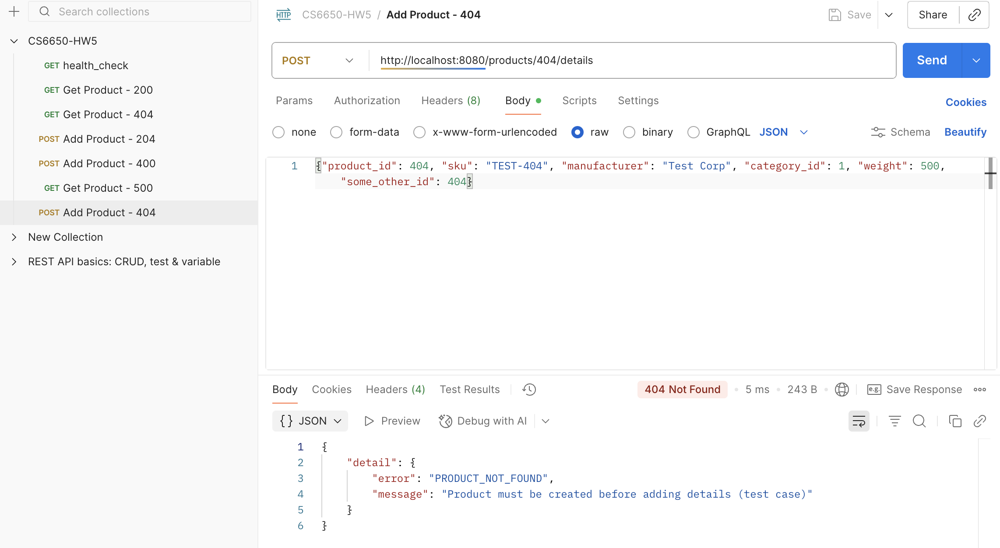
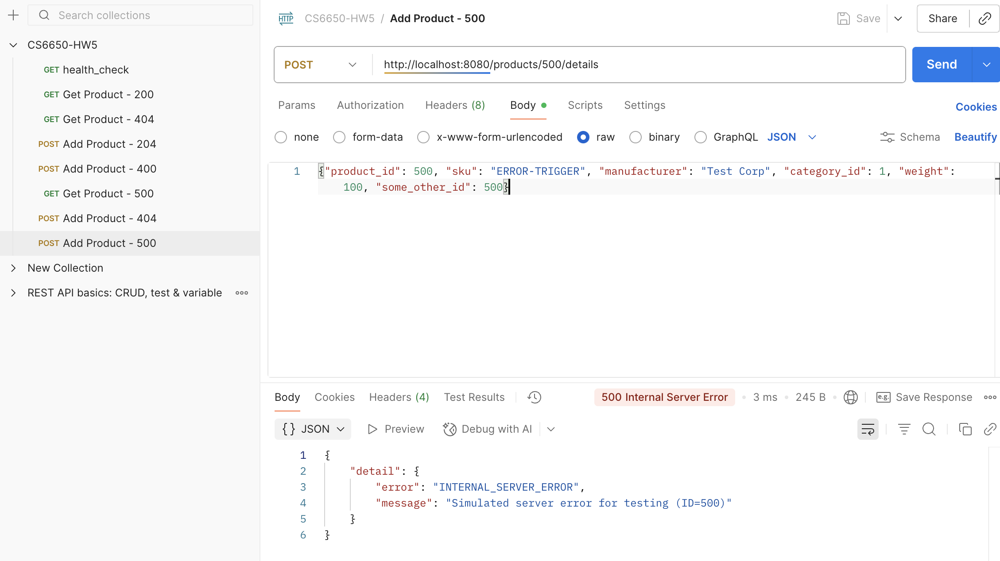

# CS6650 HW5 - Product API with Terraform Deployment

## Project Overview
This project implements a Product API based on OpenAPI specification and deploys it to AWS using Terraform infrastructure as code. The API handles product catalog operations for an e-commerce system.

## Project Structure
```
.
├── src/
│   ├── main.py              # FastAPI Product API implementation
│   ├── requirements.txt     # Python dependencies
│   └── Dockerfile           # Container configuration
├── terraform/
│   ├── main.tf             # Main Terraform configuration
│   ├── variables.tf        # Variable definitions
│   ├── outputs.tf          # Output values
│   ├── provider.tf         # AWS and Docker providers
│   └── modules/            # Resource modules (ECR, ECS, network, logging)
├── tests/
│   └── test_api.py         # Local API testing
├── locustfile.py           # Load testing configuration
├── CS6650-HW5.postman_collection.json  # Postman test collection
├── api.yaml                # OpenAPI specification
└── README.md               # This file
```

## Setup Instructions

### Prerequisites
- Python 3.11+
- Docker Desktop
- AWS CLI configured with credentials
- Terraform 1.5+
- Git

### Local Development

1. Clone the repository:
```bash
git clone https://github.com/yourusername/CS6650_2b_demo.git
cd CS6650_2b_demo
```

2. Install Python dependencies:
```bash
cd src
pip install -r requirements.txt
```

3. Run the API locally:
```bash
python main.py
# API runs on http://localhost:8080
```

### AWS Deployment

1. Configure AWS credentials:
```bash
aws configure
# Enter Access Key ID, Secret Access Key, Region: us-west-2
aws configure set aws_session_token YOUR_SESSION_TOKEN
```

2. Deploy infrastructure:
```bash
cd terraform
terraform init
terraform apply -auto-approve
```

3. Get the public IP:
```bash
aws ec2 describe-network-interfaces \
--network-interface-ids $(
    aws ecs describe-tasks \
    --cluster $(terraform output -raw ecs_cluster_name) \
    --tasks $(
        aws ecs list-tasks \
        --cluster $(terraform output -raw ecs_cluster_name) \
        --service-name $(terraform output -raw ecs_service_name) \
        --query 'taskArns[0]' --output text
    ) \
    --query "tasks[0].attachments[0].details[?name=='networkInterfaceId'].value" \
    --output text
) \
--query 'NetworkInterfaces[0].Association.PublicIp' \
--output text
```

4. Clean up resources:
```bash
terraform destroy -auto-approve
```

## API Testing

### Test Triggers
For demonstration purposes, the API includes test triggers:
- **ID=500**: Triggers 500 Internal Server Error (both GET and POST)
- **ID=404**: Triggers 404 Not Found for POST endpoint

These triggers are for testing only and would not exist in production.

### Using curl

Health Check:
```bash
curl http://localhost:8080/health
# Response: {"status": "healthy", "products_count": 2, "note": "Test triggers: ID=500 for 500 error, ID=404 for POST 404 error"}
```

Get Product (200 OK):
```bash
curl http://localhost:8080/products/1
# Response: {"product_id": 1, "sku": "LAPTOP-001", "manufacturer": "Dell", "category_id": 1, "weight": 2500, "some_other_id": 101}
```

Get Product (404 Not Found):
```bash
curl http://localhost:8080/products/999
# Response: {"detail": {"error": "PRODUCT_NOT_FOUND", "message": "Product with ID 999 not found"}}
```

Get Product (500 Server Error):
```bash
curl http://localhost:8080/products/500
# Response: {"detail": {"error": "INTERNAL_SERVER_ERROR", "message": "Simulated server error for testing (ID=500)"}}
```

Add Product (204 No Content):
```bash
curl -X POST http://localhost:8080/products/3/details \
  -H "Content-Type: application/json" \
  -d '{"product_id": 3, "sku": "TEST-003", "manufacturer": "Test Corp", "category_id": 1, "weight": 500, "some_other_id": 103}'
# Response: (empty - 204 status)
```

Add Product with ID Mismatch (400 Bad Request):
```bash
curl -X POST http://localhost:8080/products/4/details \
  -H "Content-Type: application/json" \
  -d '{"product_id": 5, "sku": "ERROR", "manufacturer": "Test", "category_id": 1, "weight": 100, "some_other_id": 1}'
# Response: {"detail": {"error": "ID_MISMATCH", "message": "Product ID in path does not match request body", "details": "Path ID: 4, Body ID: 5"}}
```

Add Product Not Found (404):
```bash
curl -X POST http://localhost:8080/products/404/details \
  -H "Content-Type: application/json" \
  -d '{"product_id": 404, "sku": "TEST-404", "manufacturer": "Test Corp", "category_id": 1, "weight": 500, "some_other_id": 404}'
# Response: {"detail": {"error": "PRODUCT_NOT_FOUND", "message": "Product must be created before adding details (test case)"}}
```

Add Product Server Error (500):
```bash
curl -X POST http://localhost:8080/products/500/details \
  -H "Content-Type: application/json" \
  -d '{"product_id": 500, "sku": "ERROR-TRIGGER", "manufacturer": "Test Corp", "category_id": 1, "weight": 100, "some_other_id": 500}'
# Response: {"detail": {"error": "INTERNAL_SERVER_ERROR", "message": "Simulated server error for testing (ID=500)"}}
```

### Using Postman

Import the `CS6650-HW5.postman_collection.json` file into Postman to run all API tests. The collection includes all response codes:

**GET /products/{productId}:**
- Health Check endpoint
- Get Product - Success (200)
- Get Product - Not Found (404)
- Get Product - Server Error (500)

**POST /products/{productId}/details:**
- Add Product - Success (204)
- Add Product - ID Mismatch (400)
- Add Product - Not Found (404)
- Add Product - Server Error (500)

###  API Testing Screenshots

#### Postman Test Results

All API endpoints have been tested using Postman. The collection includes tests for all response codes:

#### GET Endpoint Tests
- **Health Check**
  
  
- **GET 200 - Success**
  
  
- **GET 404 - Not Found**
  
  
- **GET 500 - Server Error**
  

#### POST Endpoint Tests  
- **POST 204 - Success**
  
  
- **POST 400 - ID Mismatch**
  
  
- **POST 404 - Not Found**
  
  
- **POST 500 - Server Error**
  

## Load Testing

Run Locust tests to compare HttpUser vs FastHttpUser performance:

```bash
pip install locust
locust -f locustfile.py --host=http://localhost:8080
# Visit http://localhost:8089 for web UI
```

Test results show FastHttpUser handles 5x more concurrent users with 5x higher throughput compared to HttpUser.

## Important Files

- **src/main.py**: Product API implementation using FastAPI
- **src/Dockerfile**: Docker container configuration for the API
- **terraform/**: Infrastructure as code for AWS deployment
- **api.yaml**: OpenAPI specification defining the full e-commerce API
- **locustfile.py**: Load testing scenarios
- **CS6650-HW5.postman_collection.json**: Postman test collection

## Notes

- Product data is stored in memory using Python dictionary (HashMap)
- The API validates all inputs according to OpenAPI specification
- Terraform manages AWS resources (ECS, ECR, VPC, Security Groups)
- The system uses Fargate for serverless container execution
